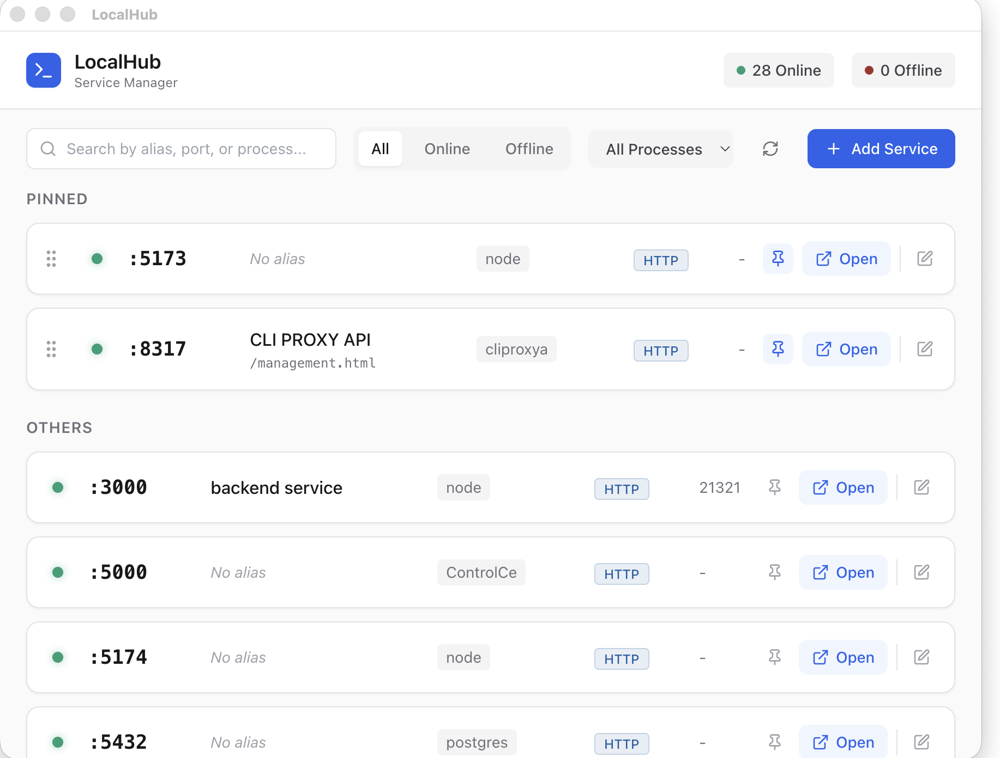

# LocalHub

[中文说明](./README_zh.md)

LocalHub is a lightweight, cross-platform local service manager and alias tool built with Electron, React, and Tailwind CSS. It automatically scans your local listening ports, allows you to assign custom aliases and notes to each service, and provides quick access via your browser.



## Features

- **Auto Port Scanning:** Automatically detects listening ports (HTTP, HTTPS, TCP, Proxy, DB, etc.) on your machine.
- **Custom Aliases & Notes:** Assign meaningful names and descriptions to your services (e.g., `openclaw.search`, `frontend.dev`) instead of remembering port numbers.
- **Quick Open:** One-click to open HTTP/HTTPS services directly in your default browser.
- **Custom Paths:** Append custom paths (e.g., `/management.html`) when opening services.
- **Pin & Reorder:** Pin your most frequently used services to the top and drag-and-drop to reorder them.
- **Process Filtering & Search:** Easily search by alias, port, or filter by process name (e.g., `node`, `postgres`).
- **Manual Entry:** Add fixed ports manually if they are not detected automatically.

## Tech Stack

- **Framework:** Electron + React (Vite)
- **Styling:** Tailwind CSS + Lucide Icons
- **State Management:** Zustand
- **Drag & Drop:** @dnd-kit
- **Persistence:** electron-store

## Getting Started

### Prerequisites

- [Node.js](https://nodejs.org/) (v16 or higher)
- npm, yarn, or pnpm

### Installation

1. Clone the repository:
   ```bash
   git clone https://github.com/yourusername/LocalHub.git
   cd LocalHub
   ```

2. Install dependencies:
   ```bash
   npm install
   ```

3. Start the development server:
   ```bash
   npm run dev
   ```

### Build for Production

To build the application into a standalone executable (e.g., `.dmg` for macOS, `.exe` for Windows):

```bash
npm run build
```

The compiled binaries will be available in the `dist` folder.

## Contributing

Contributions are welcome! Please feel free to submit a Pull Request.

## License

This project is licensed under the MIT License - see the [LICENSE](LICENSE) file for details.
